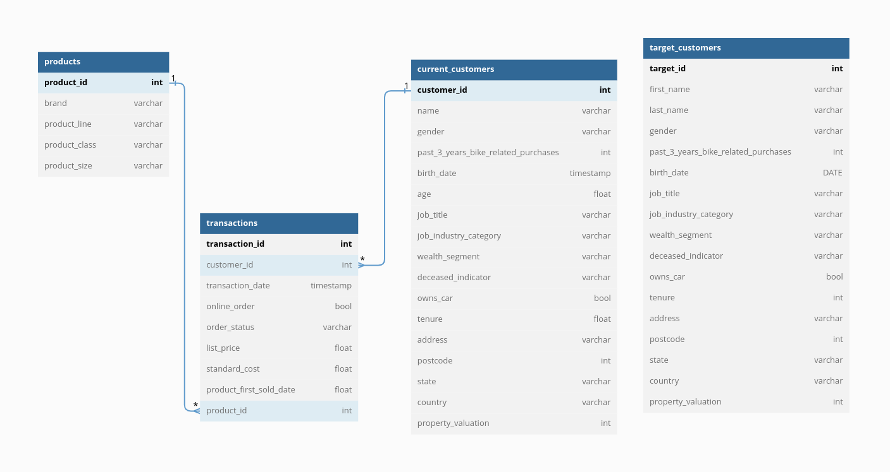

# This README explain the general database structure

### DER


> **here you can see a complete interactive and dynamic diagram**

<a href="https://dbdocs.io/javimont88/customers_transactions" target="_blank">**Dynamic DER**</a>

### Brief explanation of the database, table names, and relationships.
<p>
The deployed database deals with the theme of a bicycle and accessories company, which wants to obtain new metrics or improve the metrics about its customers and the purchases they made, and also to be able to obtain new customers.
Next we will validate the tables and their relationship:
</p>

**table products**<br>
This table contains metadata of the products such as brand, class, size, etc.

<br>**table current_customers**<br>
This table contains the metadata of each customer that has ever purchased from the store, such as name, age, address, etc.

<br>**table transactions**<br>
This is the *central table*, it contains the information of all sales and also extends its relationship with the products and current_customers tables, where each transaction can also define as much data of the customer as of the product(s). 

<br>**table target_customers**<br>
This table is not related to the previous ones, because it contains information of potential new customers, but you can make graphs and draw metrics to attract new customers, with new marketing strategies.

### Database Name is: customer_transaction

### Tables and Fields
```sql
transactions(
    transaction_id INT
    customer_id INT
    transaction_date DATE
    online_order BOOL
    order_status VARCHAR(100)
    list_price NUMERIC
    standard_cost NUMERIC
    product_first_sold_date NUMERIC
    product_id INT
)
products(
    product_id INT 
    brand VARCHAR(100)
    product_line VARCHAR(100)
    product_class VARCHAR(100)
    product_size VARCHAR(100)

)
current_customers(
    customer_id INT
    name VARCHAR(150)
    gender VARCHAR(150)
    past_3_years_bike_related_purchases INT
    birth_date DATE
    age NUMERIC
    job_title VARCHAR(150)
    job_industry_category VARCHAR(150)
    wealth_segment VARCHAR(150)
    deceased_indicator VARCHAR(150)
    owns_car BOOL
    tenure NUMERIC
    address VARCHAR(150)
    postcode INT
    state VARCHAR(150)
    country VARCHAR(150)
    property_valuation INT
)
target_customers(
    first_name VARCHAR(150)
    last_name VARCHAR(150)
    gender VARCHAR(150)
    past_3_years_bike_related_purchases INT
    birth_date DATE
    job_title VARCHAR(150)
    job_industry_category VARCHAR(150)
    wealth_segment VARCHAR(150)
    deceased_indicator VARCHAR(150)
    owns_car BOOL
    tenure INT
    address VARCHAR(150)
    postcode INT
    state VARCHAR(150)
    country VARCHAR(150)
    property_valuation INT
)
```

> In this folder we can also find the script to create the database and the tables, either locally or in the cloud.<br>
In our case we use an instance in the cloud of **AWS RDS** under a *postgres database*.